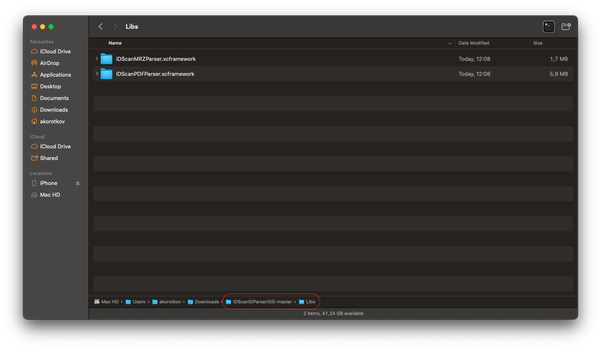
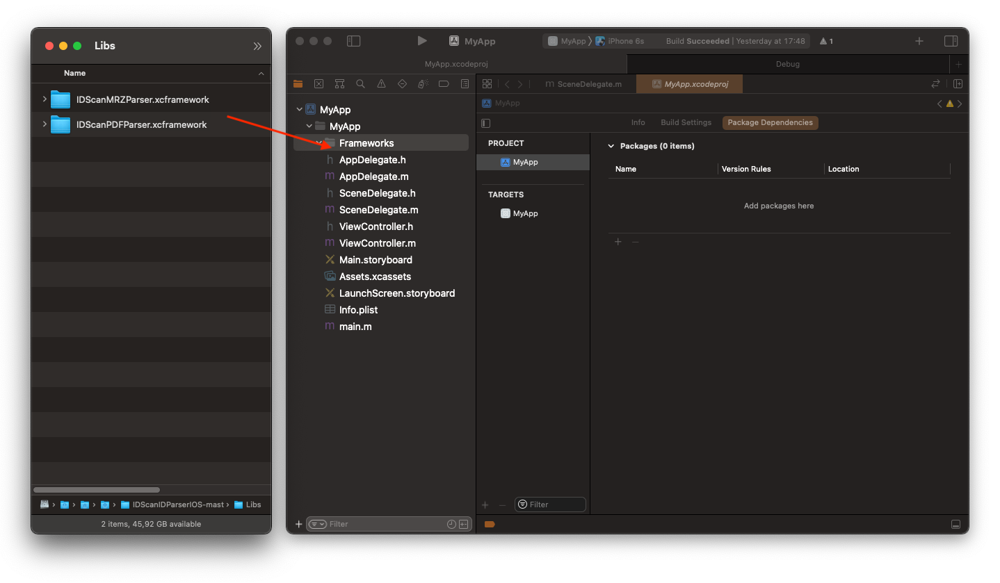
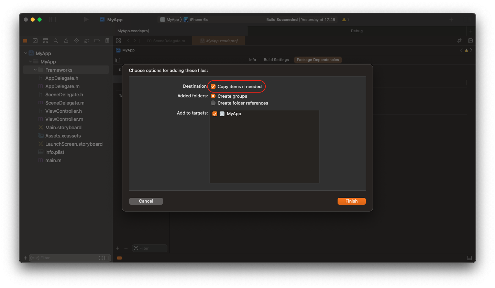
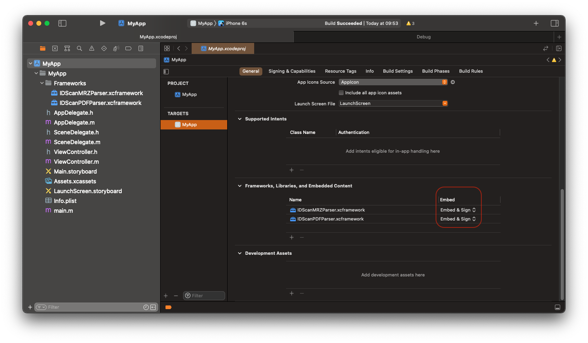

# IDScanIDParser

To install **IDScanIDParserIOS** as a `Swift Package`, please [read here](https://github.com/IDScanNet/IDScanIDParserIOS#IDScanIDParserIOS)

---

## Installing as XCFramework (relevant for both Swift and Objective-C projects)

1. [Download](https://github.com/IDScanNet/IDScanIDParserIOS/archive/master.zip) and unzip the archive with **IDScanIDParserIOS**.

---

2. Open unzipped directory. Then open `Libs` folder in it. `IDScanPDFParser.xcframework` and `IDScanMRZParser.xcframework` are located there.

---

3. Add frameworks you need to your project dragging them into the `Project navigator`.

---

4. Keep checkbox `Copy items if needed` checked, select needed targets and push the `Finish` button.

---

5. Go to `your target` → `General`, scroll down to `Frameworks, Libraries, and Embedded Content` section. Be sure, that the frameworks appeared there, otherwise add them with `+` button. Change `Embed` mode from `Do Not Embed` to `Embed & Sign`. Repeat this for all targets you selected in `step 4`.
   

---

### How to Activate and Use

Please [read here](https://github.com/IDScanNet/IDScanIDParserIOS#how-to-activate)
