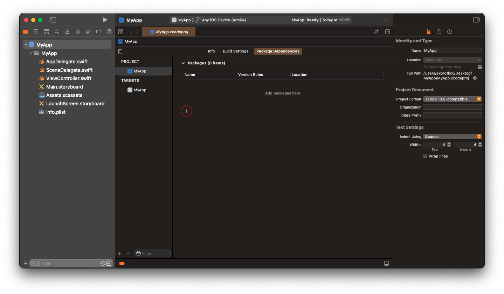
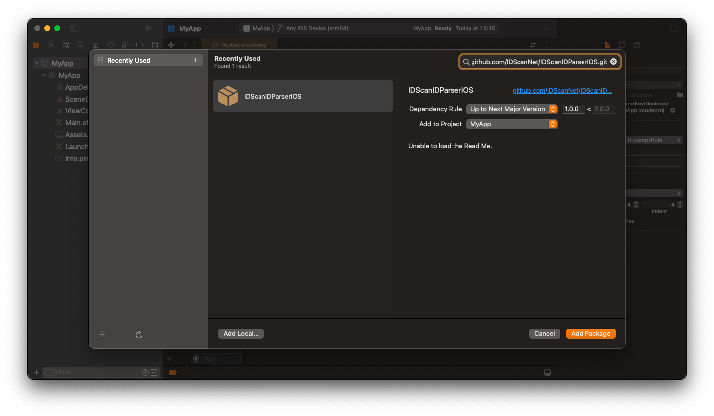
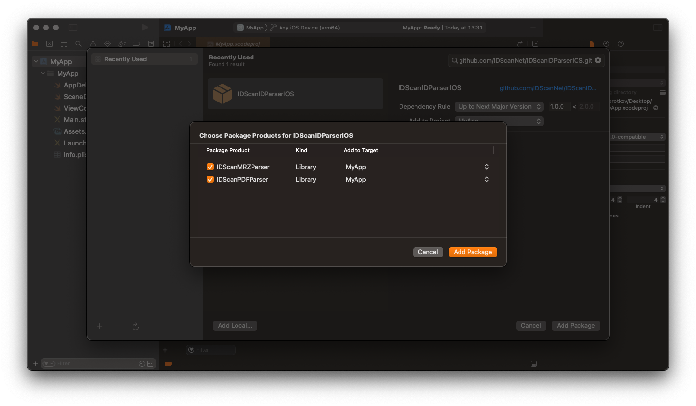

# IDScanIDParser

---

## Installation

### Installing from Xcode (relevant for both Swift and Objective-C projects)

Add the package by selecting `Your project name` → `Package Dependencies` → `+`.



---

Search for the **IDScanIDParser** using the repo's URL:
```console
https://github.com/IDScanNet/IDScanIDParserIOS
```

Next, set the `Dependency Rule` to be `Up to Next Major Version` and specify the latest version of the package as the lower bound.

Then, select `Add Package`.



---

Choose the parsers that you want to add to your project.



---

### Adding **IDScanIDParser** to a `Package.swift`

For integration via a `Package.swift` manifest instead of Xcode, you can add **IDScanIDParser** to the dependencies array of your package:

```swift
let package = Package(
    name: "MyPackage",
    dependencies: [
        .package(url: "https://github.com/IDScanNet/IDScanIDParserIOS", .upToNextMajor(from: "1.0.0"))
    ],
    // ...
)
```

Then, in any target that depends on the parsers, add it to the `dependencies` array of that target:

```swift
.target(
  name: "MyTarget",
  dependencies: [
    .product(name: "IDScanPDFParser", package: "IDScanIDParserIOS"),
    .product(name: "IDScanMRZParser", package: "IDScanIDParserIOS")
  ]
),
```

---

### Installing as XCFramework (relevant for both Swift and Objective-C projects)

How to install **IDScanIDParser** as `XCFramework`, please [read here](https://github.com/IDScanNet/IDScanIDParserIOS/tree/master/Libs#IDScanIDParser)

---

## How to Activate

### Obtaining a License Key for PDF Parser

In order to receive the License Key send an email to support@idscan.net with the Bundle ID. Please be sure to provide your order number in the email once ready to upgrade from trial to production mode. A unique Serial number/Registration Key for this Bundle ID.

---

## Usage

### Swift

```swift
import IDScanPDFParser
import IDScanMRZParser
```

```swift
let pdfParser = IDScanPDFParser(activationKey: "your License key") // = IDScanPDFParser() for demo mode or you can specify activationKey later
let mrzParser = IDScanMRZParser() // IDScanMRZParser is free to use and doesn't need a license key
```

```swift
func resultFromDetector(_ rawString: String, type: String) { //you can use the IDScanIDDetector (https://github.com/IDScanNet/IDScanIDDetectorIOS) to get the raw string from device camera or images
    switch type {
        case "pdf":
            if let parsedData = self.pdfParser.parse(rawString) as? [String : String] {
                self.resultFromParser(parsedData, type: type)
            }
        case "mrz":
            if let parsedData = self.mrzParser.parse(rawString) as? [String : String] {
                self.resultFromParser(parsedData, type: type)
            }
        default: break
    }
}

func resultFromParser(_ parsedData: [String : String], type: String) {
    let firstName = parsedData["firstName"]
    let birthDate = parsedData["birthDate"]
    let licenseNumber = parsedData["licenseNumber"]
    //etc
}
```

### Objective-C

```objc
@import IDScanPDFParser;
@import IDScanMRZParser;
```

```objc
@property (strong, nonatomic) IDScanPDFParser *pdfParser;
@property (strong, nonatomic) IDScanMRZParser *mrzParser;
```

```objc
- (void)configureParsers {
    self.pdfParser = [IDScanPDFParser parserWithActivationKey:@"your License key"]; // = [[IDScanPDFDetector alloc] init] for demo mode or you can specify activationKey later
    self.mrzParser = [[IDScanMRZParser alloc] init]; // IDScanMRZParser is free to use and doesn't need a license key
}

- (void)resultFromDetector:(NSString *)rawString type:(NSString *)type { //you can use the IDScanIDDetector (https://github.com/IDScanNet/IDScanIDDetectorIOS) to get the raw string from device camera or images
    if ([type isEqualToString:@"pdf"]) {
        NSDictionary<NSString *, NSString *> *parsedData = [self.pdfParser parse:rawString];
        [self resultFromParser:parsedData type:type];
    } else if ([type isEqualToString:@"mrz"]) {
        NSDictionary<NSString *, NSString *> *parsedData = [self.mrzParser parse:rawString];
        [self resultFromParser:parsedData type:type];
    }
}

- (void)resultFromParser:(NSDictionary<NSString *, NSString *> *)parsedData type:(NSString *)type {
    NSString *firstName = parsedData[@"firstName"];
    NSString *birthDate = parsedData[@"birthDate"];
    NSString *licenseNumber = parsedData[@"licenseNumber"];
    //etc
}
```
