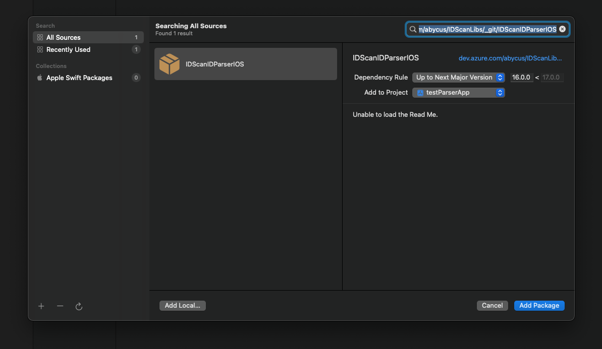
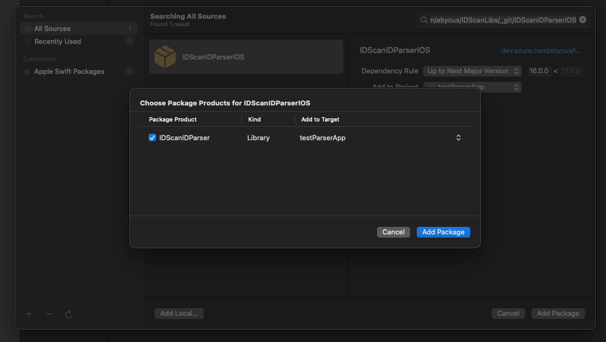

# IDScanIDParser

The IDScanIDParser library provides functionality for parsing PDF417 and MRZ strings of identification documents. 

---

## Installation

### Installing from Xcode (relevant for both Swift and Objective-C projects)

Add the package by selecting `Your project name` → `Package Dependencies` → `+`.



---

Search for the **IDScanIDParser** using the repo's URL:
```console
https://github.com/IDScanNet/IDScanIDParserIOS
```

Next, set the `Dependency Rule` to be `Up to Next Major Version` and specify the latest version of the package as the lower bound.

Then, select `Add Package`.




---

### Adding **IDScanIDParser** to a `Package.swift`

For integration via a `Package.swift` manifest instead of Xcode, you can add **IDScanIDParser** to the dependencies array of your package:

```swift
let package = Package(
    name: "MyPackage",
    dependencies: [
        .package(url: "https://github.com/IDScanNet/IDScanIDParserIOS", .upToNextMajor(from: "2.0.0"))
    ],
    // ...
)
```

Then, in any target that depends on the parsers, add it to the `dependencies` array of that target:

```swift
.target(
  name: "MyTarget",
  dependencies: [
    .product(name: "IDScanIDParser", package: "IDScanIDParserIOS")
  ]
),
```
## Usage

### Swift

```swift
import IDScanIDParser

// Initialize the parser
let parser = IDScanIDParser()

// Set the license key
let licenseKey = "YOUR_LICENSE_KEY"
let isLicensed = parser.setLicense(licenseKey)
if !isLicensed {
    print("Wrong license.")
    exit(1)
}

// Parse the track string
let trackString = "YOUR_TRACK_STRING"
if let result = parser.parse(trackString) {
    print("Parsed Data: \(result)")
} else {
    print("Failed to parse the track string.")
}
```

### Objective-C

```objective-c

// Initialize the parser
IDScanIDParser *parser = IDScanIDParser.new;

// Set the license key
NSString *licenseKey = @"YOUR_LICENSE_KEY";
BOOL isLicensed = [parser setLicense:licenseKey];
if (!isLicensed) {
    NSLog(@"Wrong license.");
    exit(1);
}

// Parse the track string
NSString *trackString = @"YOUR_TRACK_STRING";
NSDictionary *result = [parser parse:trackString];
if (result) {
    NSLog(@"Parsed Data: %@", result);
} else {
    NSLog(@"Failed to parse the track string.");
}
```

## API Documentation

- **`setLicense(_ license: String) -> Bool`**

  Sets the license key for the parser.

  - **Parameters:**
    - `license`: The license key string.
  - **Returns:**
    - `Bool`: `true` if the license is set successfully, `false` otherwise.

- **`parse(_ trackString: String) -> [String: String]?`**

  Parses the given track string and returns the parsed data as a dictionary.

  - **Parameters:**
    - `trackString`: The track string to parse.
  - **Returns:**
    - `[String: Any]?`: A dictionary containing the parsed data, or `nil` if parsing fails.

## How to Activate

### Obtaining a License Key for ID Parser

In order to receive the License Key send an email to support@idscan.net with the Bundle ID. Please be sure to provide your order number in the email once ready to upgrade from trial to production mode. A unique Serial number/Registration Key is provided for this Bundle ID.

---

## Migration from version 1.0

- Now you don't need to create parsers for PDF and MRZ separately. Parser 2.0 supports both of these types.
- Now the license key must be passed using the setLicense function.
- Parser 2.0 returns the response in a new format. The key names and data formats may differ from the version 1.0 response.
